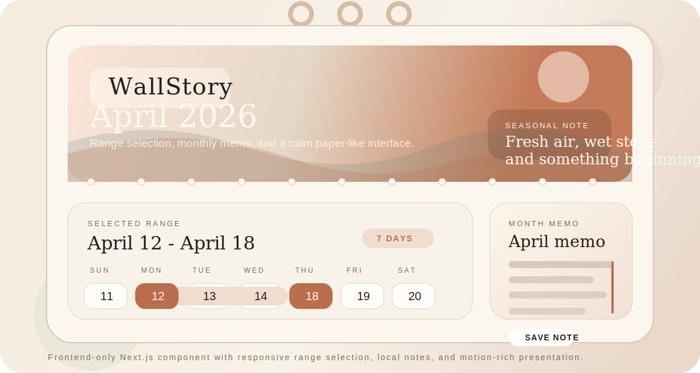

# WallStory Calendar



WallStory Calendar is a polished, frontend-only wall calendar built with Next.js, React, Tailwind CSS, Framer Motion, and `date-fns`. The experience is designed around a physical wall-calendar metaphor: a monthly hero image, a tactile paper-like date grid, responsive range selection, and an integrated notes workspace that now supports both a month memo and a selection-linked note.

## Links

- Repository: https://github.com/SmithC05/Calendar
- Live Demo: pending Vercel deployment from this workspace
- Video Demo: add your Loom or YouTube walkthrough link here after recording

## What is implemented

- Physical wall calendar styling with a large monthly hero panel, decorative hanger rings, paper textures, and perforation details.
- Interactive date-range selection with distinct visual states for start date, end date, in-range days, and single-day selections.
- Integrated notes workflow with two modes:
  - Month memo for broad planning and reminders.
  - Selection note for a single date or a chosen range.
- Persistent frontend-only state via `localStorage` for the current month, selected dates, theme preference, and notes.
- Responsive layout that stays touch-friendly on mobile and expands into a gallery-style desktop composition.
- Extra polish through theme switching, animated month transitions, seasonal art direction, and holiday/event markers.

## Challenge Coverage

| Requirement | How this project covers it |
| --- | --- |
| Wall calendar aesthetic | A prominent monthly hero image anchors the experience, while the calendar grid and note surface use paper, shadow, and hanging-calendar cues. |
| Day range selector | Clicking once creates a start date, clicking again completes the range, and the UI clearly differentiates start, end, and in-between days. |
| Integrated notes section | Users can save a month-wide memo or attach notes directly to a selected date or date range. |
| Fully responsive design | The layout stacks cleanly on small screens and expands into segmented panels on larger screens without losing usability. |
| Frontend-only scope | No backend, no API dependency for core behavior, and persistence is handled with `localStorage`. |
| Creative extras | Theme toggle, animated transitions, holiday markers, optional Unsplash hero photos, and submission-ready GitHub presentation. |

## Technical Choices

- `app/` router with a focused component split under `components/wall-calendar/`.
- `date-fns` utilities for month generation, formatting, and date-range logic.
- `framer-motion` for animated month changes, state transitions, and interface feedback.
- Tailwind CSS plus CSS custom properties for the paper-like visual system and theme switching.
- Optional `NEXT_PUBLIC_UNSPLASH_ACCESS_KEY` support for live seasonal hero photography. If the key is not provided, the app falls back to bundled SVG artwork.

## Run locally

```bash
npm install
npm run dev
```

Open `http://localhost:3000`.

If you want live Unsplash photography instead of the built-in themed artwork, add this to `.env.local`:

```bash
NEXT_PUBLIC_UNSPLASH_ACCESS_KEY=your_key_here
```

## Suggested demo walkthrough

1. Show the desktop layout and explain the wall-calendar visual direction.
2. Select a single day, then extend it into a multi-day range.
3. Save a range-linked note and switch to the month memo.
4. Change months and show the animated hero transition.
5. Toggle between light and dark themes.
6. Collapse to a mobile viewport and repeat a quick range + note interaction.

## Validation

- `npm run lint`
- `npm run build`

Both commands pass in this workspace.
